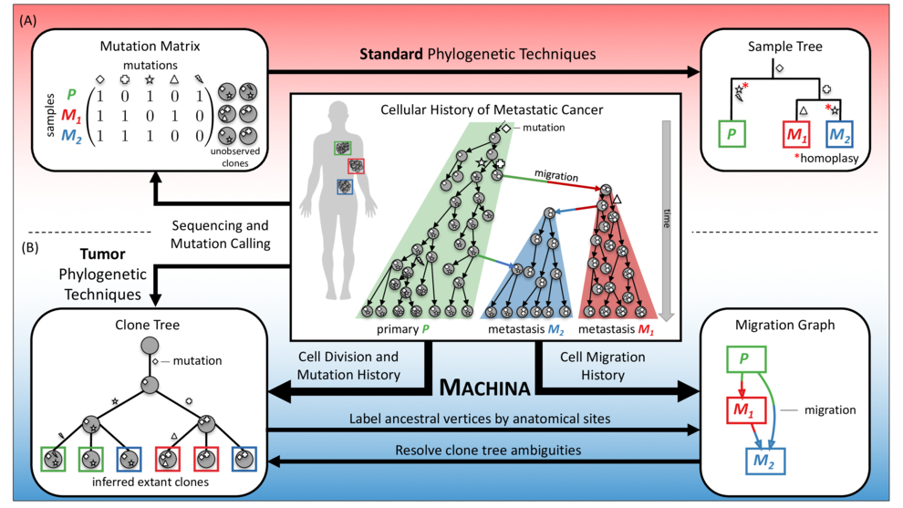
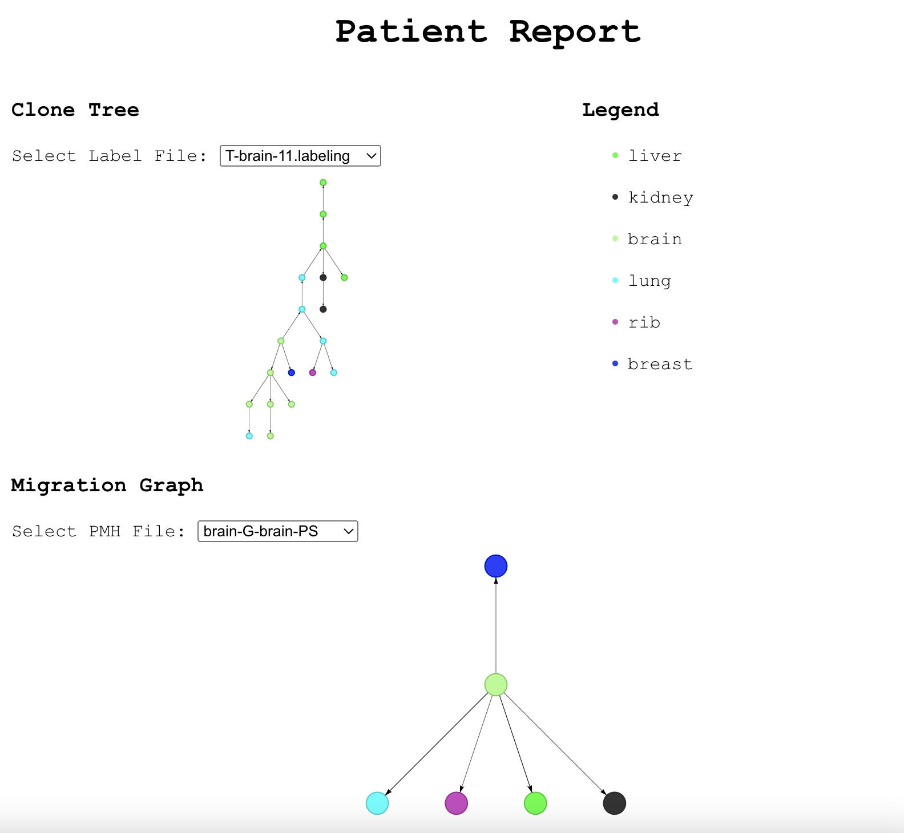

# MACHINA Interactive Visualization
Akul Joshi, Vikram Ramavarapu



## Installation and Setup
Installation and set up is very simple. Simply run the following commands:
```
cd machinaviz
npm install && npm start
```
You will then get the following return message:
```
Compiled successfully!

You can now view machinaviz in the browser.

  Local:            http://localhost:<port number>
```
In which case, simply open a browser and go to `http://localhost:<port number>`

## Usage
Simply select a dataset and a patient ID to view the clonal trees and migration graphs. Clonal trees may have a dropdown for individual PMH Sankoff outputs if a clonal tree does not have a reported labelling. Migration graphs will have a dropdown menu as PMH has multiple solutions for any given clonal tree.  
  
To switch to a different patient or dataset, simply deselect your current patient or dataset and switch to a new one.


